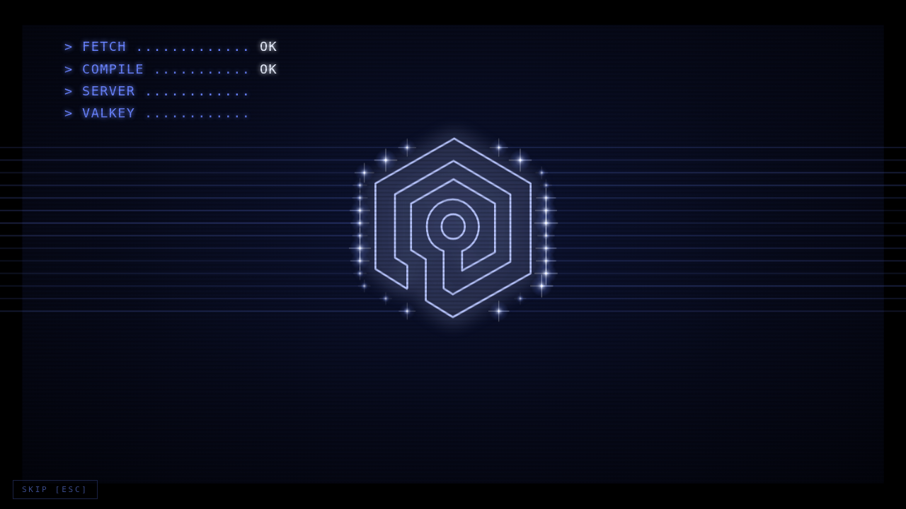
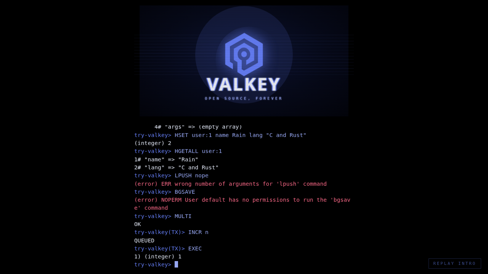

# Try Valkey without 32-bit Valkey

*One-pager. Rain Valentine, September 2026. Branch `exp/try-valkey-wasm` on valkey-rainfall/valkey.*

## The problem

[try.valkey.io](https://valkey.io/try-valkey/) lets people run Valkey commands in a browser. It works by booting a
frozen Alpine Linux image inside v86, a 32-bit x86 emulator, with a 32-bit `valkey-server` 7.2.6 from Alpine's
package repository and `valkey-cli` on the serial console ([valkey-io/valkey#1412](https://github.com/valkey-io/valkey/issues/1412)).
That page is the main reason Valkey still builds and tests a 32-bit target. It has also been stuck on 7.2.6 since it
shipped, because producing a new 32-bit image per release was never automated.

## The proposal

Compile the real `valkey-server` to WebAssembly as a **64-bit (LP64) program** and run it in the tab directly. No
emulator, no Linux image, no 32-bit code paths. The 2024 proposal rejected WASM because "WASM does not support TCP
networking"; the server does not need TCP. It needs a `ConnectionType`, and that is already a pluggable abstraction
(the RDMA transport registers one out of tree). A ~400-line in-memory connection type driven from JavaScript is the
whole bridge; everything above it (client creation, RESP parsing, command execution, MULTI, pub/sub, blocking
commands, `CLIENT LIST`) is the unmodified server.

Emscripten compiles the C with 64-bit pointers and then lowers the module to plain wasm32, so `sizeof(long)==8`
throughout while the artifact runs in every current browser, Safari included (true memory64 is Chrome 133+ /
Firefox 134+ only; it is one link flag away when Safari catches up).

## What was built and measured

| | |
|---|---|
| Artifact | 2.1 MB `.wasm` (658 KB brotli) + 107 KB JS. Cold start 40-70 ms. `INFO` reports `arch_bits:64` |
| Fidelity | 607-command differential vs a native build at the same SHA: 605 replies byte-identical (the two differences: `CLIENT INFO` shows `addr=mem:0`; `LOLWUT` is random) |
| **Stock Tcl unit suite** | **2508 passed, 0 failed** (59 units, run over a TCP-to-in-memory bridge). Skipped: busy-script KILL tests, replication-stream tests (`SYNC` needs fork), IPv6 bind, `CLIENT LIST ip` filters |
| Native, same patches | C unit tests 828/828; Tcl 5554 passed, 0 failed |
| CLI layer | Same 97 command lines through real `valkey-cli --no-raw` and the JS layer: 96 identical. Splitting is `sdssplitargs` itself, exported from the module; formatting is a port of `cliFormatReplyTTY` |
| Page | The Valkey sign-on animation, with its tape loader driven by the real `.wasm` download and its boot readout by real events (fetch, instantiate, `Server initialized`, `Ready to accept connections`), handing off to a real client |

## Patch footprint

538 lines across 12 files against `da91ccd12`; 413 of them are the new `connmem.c`.

- **Real bugs, upstreamable on their own.** `valkeymodule.h` declares `FreeModuleUser`, `ACLAddLogEntry`,
  `ACLAddLogEntryByUserName` as `void`; the implementations (and their docs) return `int`. Harmless on x86-64, a
  trap on wasm the moment a Lua script calls `redis.acl_check_cmd`. `getTimeZone()` on non-Linux reads
  `gettimeofday`'s obsolete timezone argument. `luaReplyToServerReply` recurses ~8000 deep before Lua's stack check
  fires, which only works with an 8 MB native stack. `bio.c`'s job loop body is now a function (pure refactor).
- **`__EMSCRIPTEN__`-gated, arguably in-tree.** The `CONN_TYPE_MEM` transport (also a socket-free harness for driving
  the full client path in-process); a threadless `BIO_INLINE` mode so the build needs no SharedArrayBuffer and can be
  served from GitHub Pages as-is; the recursion cap above.
- **Glue, could live in an overlay.** ~50 lines in `ae.c`, `server.c`, `module.c`, `socket.c`: hand the event loop
  to the host, register the mem listener, resolve the static Lua module without `dlsym`, fail TCP listen cleanly.

## What it costs, honestly

- **Single thread.** A `while true do end` script cannot be interrupted by `SCRIPT KILL` from a second connection;
  there is no thread to deliver it. Fixable with a Worker and an `Atomics.wait` wake, at the price of COOP/COEP.
- **No fork.** `BGSAVE`, `BGREWRITEAOF`, replication are denied via ACL for the visitor; plain `SAVE` works.
- **Toolchain care.** Emscripten's 64 KB default stack silently corrupted the heap (lzf keeps a 64K-slot table on
  the stack); `long double` prints at double precision unless asked otherwise. Both are link flags now, both are
  the kind of thing that only a full test-suite run finds.
- **Fewer tutorial options than a VM.** The 2024 design could freeze a multi-node cluster inside the image. That is
  N instances in N Workers here, not day one.

## What it buys

Instant start instead of booting a VM; a fraction of the download; the current release instead of 7.2.6, from one
CI job (`emmake make` on tag); a page that keeps working the day `make 32bit` is deleted. And, as a side effect,
three latent portability bugs in Valkey fixed.

## Ask

1. Confirm the direction: try-valkey moves to the wasm build; the 32-bit conversation proceeds without it as a blocker.
2. Review the Tier-1 fixes as ordinary PRs to valkey-io/valkey.
3. Decide where the transport and the `__EMSCRIPTEN__` glue live: in tree behind a build flag, or in the try-valkey repo as a patch set.
4. Someone with a Mac loads the page in Safari.
